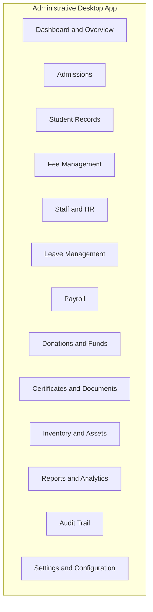
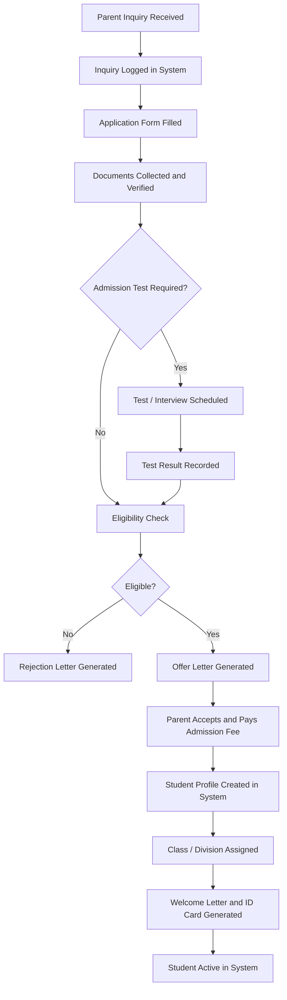
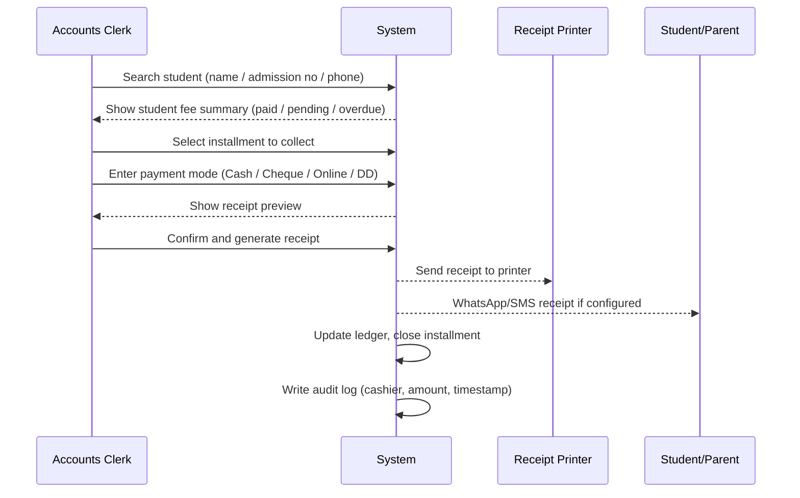
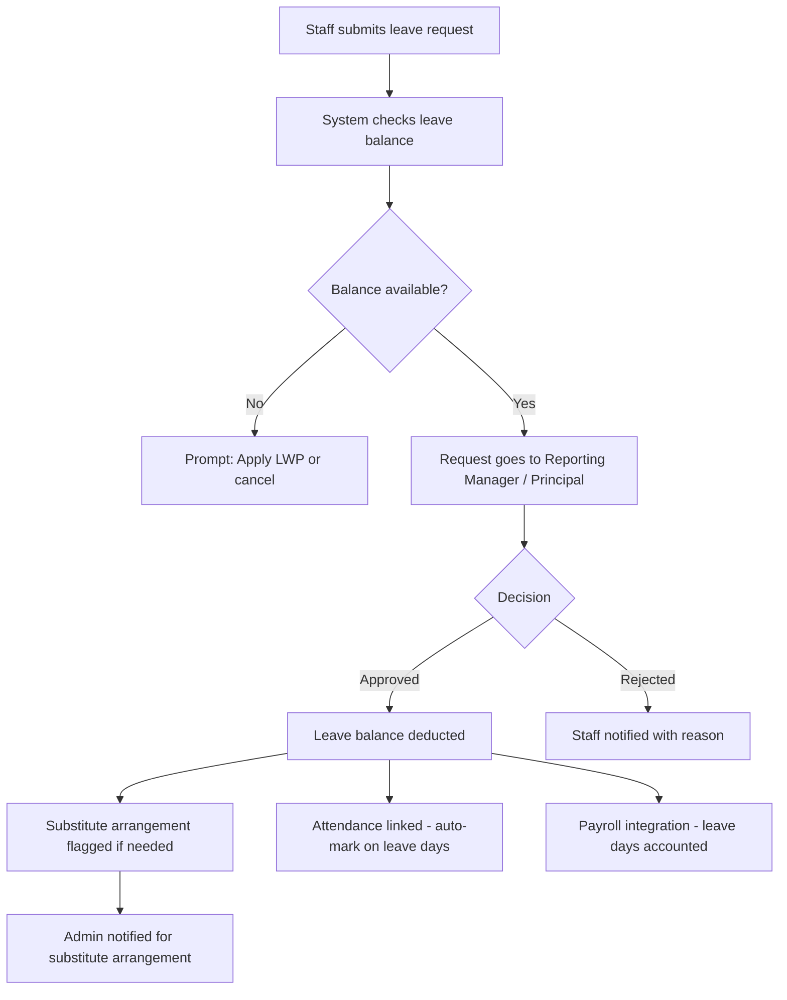
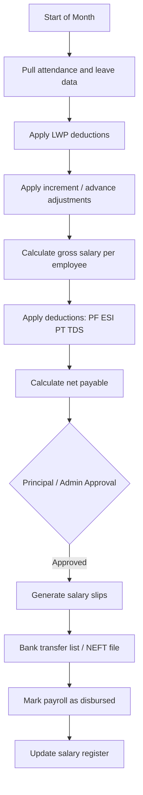
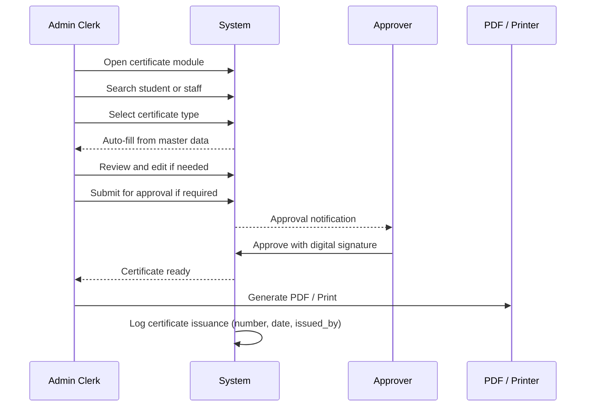
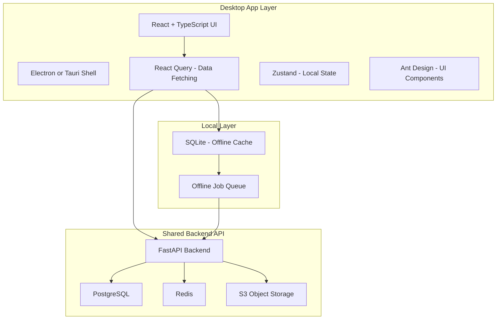

# School Administrative Department — Desktop Application
## System Design Document

> **Scope**: This document defines the complete design for the **Administrative Department Desktop Application** — the back-office control center used by Admins, Principals, Accounts Staff, and Office Clerks to run the school day-to-day. This is a standalone desktop app (Electron + React or Tauri + React), designed for Windows, that connects to the same backend used by the teacher/student mobile apps.

---

## 1. Executive Summary

### Problem
School administrative departments still manage admissions in spreadsheets, fees in registers, staff records in folders, and donations/certifications in disconnected tools. There is no single system that handles the full administrative lifecycle — from a student's first inquiry to graduation, and from a staff member's joining to their payroll exit.

### Solution
A **desktop-first application** for the administrative office that gives clerks, accounts staff, the principal, and admin managers a powerful, structured workspace to manage:

- Student admissions and enrollment
- Fee collection, receipts, and dues
- Staff records and HR management
- Teacher leave requests and approval
- Donations, funds, and financial tracking
- Certificates and documents issuance
- Payroll processing
- Inventory and assets
- Regulatory compliance and government portal exports
- Reports and audit trails

### Design Principles
1. **Office-first UX** — Designed for desktop screens, keyboard-friendly, rapid data entry
2. **Zero data loss** — Every transaction is immutable with audit logs
3. **Role-safe** — Clerk, Accounts, Principal, Admin each see only what they need
4. **Print-ready** — Every receipt, certificate, and ledger can be printed or exported as PDF
5. **Offline-tolerant** — Core operations queue locally and sync when network restores
6. **Bilingual** — All forms and printouts support Marathi and English

---

## 2. Target Users & Roles

| Role | Job | Modules They Use |
|---|---|---|
| **Super Admin** | IT/Owner-level access | All modules, settings, user management |
| **Principal** | School head | Approvals, staff leaves, overview dashboard, reports |
| **Office Admin** | General admin clerk | Admissions, student records, documents, certificates |
| **Accounts Staff** | Fee and finance clerk | Fee collection, receipts, donations, ledgers, expense vouchers |
| **HR/Staff Manager** | Staff records and leaves | Staff profiles, leave management, payroll inputs |
| **Payroll Clerk** | Salary processing | Payroll, salary slips, PF/tax records |
| **Inventory Clerk** | Asset and store management | Inventory, purchase orders, asset register |

---

## 3. Module Map



---

## 4. Module-by-Module Design

---

### 4.1 Dashboard & Overview

**Purpose**: Give the admin a real-time bird's-eye view of the school's operational health.

#### Key Widgets
| Widget | Data Shown |
|---|---|
| Today's Snapshot | Date, school day number, active students, staff present |
| Fee Alerts | Outstanding dues count, today's collections, overdue >30 days |
| Pending Actions | Admission inquiries pending, leave requests pending, certificates pending |
| Recent Activity | Last 10 actions across all modules |
| Donation Summary | Month-to-date donations, fund balances |
| Quick Actions | New Admission, Collect Fee, Issue Certificate, View Report |

#### Screen Layout
```
+------------------------------------------------------------------+
|  SCHOOL NAME           [Date: 09 Apr 2026]      [User: Admin]   |
+----------+-------------------------------------------------------+
|          |  TODAY'S SNAPSHOT  |  FEE ALERTS    |  ACTIONS       |
|  LEFT    |-----------------------------------------             |
|  SIDEBAR |  RECENT ACTIVITY   |  QUICK ACTIONS                  |
|  (Nav)   |----------------------------------------------------- |
|          |  PENDING ITEMS (Admissions / Leaves / Certs)         |
+----------+------------------------------------------------------+
```

---

### 4.2 Admissions Module

**Purpose**: Manage the full admission lifecycle from inquiry to enrollment.

#### Sub-modules
1. Inquiry Management
2. Application Form
3. Document Checklist
4. Admission Test / Interview Scheduling
5. Offer and Acceptance
6. Enrollment and Student Profile Creation
7. Admission Cancellation

#### Workflow


#### Data Fields — Student Admission Record

**Inquiry**
- inquiry_id (auto)
- inquiry_date
- parent_name, parent_phone, parent_email
- student_name (as known)
- applying_for_standard
- current_school
- source (walk-in, phone, website, reference)

**Application**
- application_number (auto, formatted: APP-YYYY-NNNN)
- application_date
- student_full_name (as per birth certificate)
- date_of_birth, gender
- religion, caste, category (SC/ST/OBC/Open)
- aadhaar_number
- mother_name, father_name
- address (permanent, current)
- emergency_contact
- previous_school_name, TC_number, marks

**Documents Checklist**
- birth_certificate (uploaded / collected)
- transfer_certificate
- aadhaar_copy
- caste_certificate (if applicable)
- income_certificate (if applicable)
- passport_photos (count)
- previous_marksheet
- domicile_certificate

**Admission Decision**
- status (inquiry / applied / test_scheduled / offered / enrolled / cancelled)
- test_date, test_score
- offer_date, offer_letter_number
- acceptance_date
- rejection_reason (if rejected)

**Enrollment**
- admission_number (final, school-format: YEAR-NNNN)
- admission_date
- standard, division, academic_year, roll_number

#### Business Rules
- Inquiry to Application can exist without converting to full admission
- Application number is immutable once assigned
- Documents checklist is configurable per school standard
- Admission number format is set in School Settings
- Cancelled admissions are archived, not deleted

---

### 4.3 Student Records Module

**Purpose**: Maintain the complete student master record throughout their school life.

#### Key Features
| Feature | Description |
|---|---|
| Student Master | Full profile with all personal, family, and academic data |
| Photo and Documents | Store scanned documents, photos, Aadhaar |
| Class History | Year-by-year standard/division/roll number history |
| Conduct Record | Disciplinary notes, awards, achievements |
| Health Record | Blood group, medical conditions, emergency contact |
| TC Issuance | Generate Transfer Certificate with school seal format |
| Bonafide Certificate | Auto-generate from current enrollment data |
| Student ID Card | Print-ready ID card generator |
| Bulk Import | Import student list via Excel template |

---

### 4.4 Fee Management Module

**Purpose**: Complete fee lifecycle — from structure definition to collection, receipts, and outstanding management.

#### Sub-modules
1. Fee Structure Setup
2. Fee Plan Assignment
3. Fee Collection Counter
4. Online Payment Reconciliation
5. Concessions and Waivers
6. Outstanding and Dues Management
7. Receipts and Ledger
8. Refunds
9. Fee Reports

#### Fee Structure Design
- **fee_head**: head_id, head_name (English + Marathi), is_recurring (monthly/term/annual), is_mandatory
- **fee_plan**: plan_id, academic_year, standard, board, medium, fee_lines (head + amount + due_date)
- **student_fee_assignment**: student_id, plan_id, concession_applied, concession_reason, concession_approved_by, final_amount_due

#### Fee Collection Workflow


#### Fee Receipt Fields
- Receipt number (immutable, sequential)
- Date and time
- Student name, admission number, standard, division
- Fee heads collected (itemized)
- Total amount, payment mode
- Cheque number / transaction ID if applicable
- Cashier name
- School seal and signature line
- Printable in A5 or 80mm thermal format

#### Business Rules
- Receipts are **immutable** — corrections create a new reversal receipt
- Concessions require approval from Principal or Admin role
- Partial payments allowed — system tracks outstanding per head
- Cheque payments marked as pending clearance until confirmed
- Daily cashier summary auto-generated at EOD
- Overdue alerts generated after configurable grace period

---

### 4.5 Staff & HR Module

**Purpose**: Maintain complete personnel records for all school staff.

#### Staff Record Fields

**Personal**: staff_id, full_name, date_of_birth, gender, religion, caste, category, aadhaar_number, PAN_number, address, emergency_contact

**Employment**: designation, department, employment_type (Permanent/Contract/Part-time/Aided/Unaided), joining_date, confirmation_date, reporting_to, appointment_letter_number

**Academic Qualifications**: qualifications[], teaching_subjects[]

**Service Record**: promotions[], transfers[], awards[], disciplinary_actions[], annual_increments[]

**Documents**: appointment_letter, qualification_certificates, experience_certificates, caste_certificate, aadhaar and PAN scans

**Exit**: resignation_date, last_working_date, reason_for_exit, experience_certificate_issued, relieving_letter_issued

#### Key Features
- Staff directory with search and filter
- Org chart / hierarchy view
- Qualification verification tracker
- Document expiry alerts (e.g., medical fitness certificates)
- Service book maintenance
- UDISE staff data and Shalarth sync export
- Bulk staff import via Excel

---

### 4.6 Leave Management (TL — Teacher Leave)

**Purpose**: Handle leave applications, approvals, and tracking for all staff.

#### Leave Types
| Leave Type | Code | Paid? | Carried Over? |
|---|---|---|---|
| Casual Leave | CL | Yes | No |
| Sick Leave | SL | Yes | Partial |
| Earned / Privilege Leave | EL/PL | Yes | Yes |
| Maternity Leave | ML | Yes | N/A |
| Paternity Leave | PTL | Yes | N/A |
| Half-Day Leave | HDL | Yes | No |
| Leave Without Pay | LWP | No | No |
| Compensatory Off | CO | Yes | Yes (limited) |
| Duty Leave / OD | DL | Yes | No |

#### Leave Workflow


#### Leave Tracker Screen
- Calendar view showing who is on leave each day
- Balance card per employee (CL / SL / EL remaining)
- Pending approvals queue for Principal
- Auto-calculation of LWP for excess leave
- Leave encashment at year-end if policy allows
- Leave register printout in government format

---

### 4.7 Payroll Module

**Purpose**: Process monthly salary, generate pay slips, and maintain salary records.

#### Payroll Workflow


#### Salary Structure Components

**Earnings**: Basic Pay, DA (Dearness Allowance), HRA (House Rent Allowance), TA / Conveyance, Medical Allowance, Special Allowance, Other Allowances

**Deductions**: PF (12% of Basic), ESI (if applicable), PT (Professional Tax — Maharashtra slabs), TDS (Income Tax), Advance Recovery, Other deductions

**Net Pay = Total Earnings - Total Deductions**

#### Key Features
- Salary structure templates per designation
- Auto-pull from attendance/leave for LWP calculation
- Maharashtra Professional Tax auto-slab calculation
- PF challans (Form 12A) auto-generation
- ESI calculation and report
- Form 16 and TDS certificate generation
- Salary slip PDF (printable and digital)
- Bank NEFT file export
- Salary register (annual) export

---

### 4.8 Donations & Funds Module

**Purpose**: Record, track, and report all donations, grants, and fund inflows to the school.

#### Donation Types
| Type | Examples |
|---|---|
| Parent Donation | School building fund, development fund |
| Alumni Donation | Infrastructure, scholarships |
| Government Grant | State/central education grants, scholarships |
| CSR Donation | Corporate Social Responsibility contributions |
| Trust Fund Transfer | From parent trust / society |
| Event Revenue | Annual day, sports day, fairs |
| Scholarship Fund | Dedicated scholarship pool |

#### Donation Record Fields
- donation_id (auto), donation_date
- donor_type (parent / alumni / organization / government / anonymous)
- donor_name, donor_contact, donor_PAN (for 80G receipt if applicable)
- donation_amount, payment_mode (Cash / Cheque / NEFT / DD)
- cheque_number / transaction_id
- purpose / fund_head, fund_linked_to
- receipt_number (80G or standard)
- acknowledgement_letter_generated, notes

#### Key Features
- Fund heads management (create named funds/pools)
- 80G receipt generation for NGO/Trust schools
- Donation acknowledgement letter (personalized)
- Fund utilization tracking (donations in vs expenses out per fund)
- Government grant tracking with disbursement schedule
- Scholarship fund management — student, amount, academic year
- Annual donation report
- Trust account reconciliation

---

### 4.9 Certificates & Documents Module

**Purpose**: Issue and track all official certificate types generated by the school.

#### Certificate Types
| Certificate | Trigger | Auto-data From |
|---|---|---|
| Transfer Certificate (TC) | Student leaving school | Student master, service record |
| Bonafide Certificate | On request | Current enrollment |
| Character Certificate | On request | Conduct record |
| Migration Certificate | Board exam after class 10/12 | Exam results |
| Study Certificate | On request | Enrollment + fee clearance |
| Experience Certificate | Exiting staff | Staff service record |
| Relieving Letter | Exiting staff | Staff exit record |
| Appointment Letter | New staff joining | HR module |
| Salary Certificate | Staff request | Payroll |
| No Dues Certificate | Student/staff | Fee/salary clearance |
| Scholarship Certificate | Award | Donation/scholarship module |
| Achievement Certificate | Custom | Manual entry |

#### Certificate Workflow


#### Certificate Control Rules
- Every certificate has a unique sequential number per type (e.g., TC-2025-0047)
- TC requires fee clearance verification before issuance
- Principal digital signature embedded in PDF for TC and Migration certs
- Duplicate certificates marked as DUPLICATE COPY with original issue date
- Certificate register maintained per type

---

### 4.10 Inventory & Assets Module

**Purpose**: Track school property, consumable stock, and procurement.

#### Asset Types
| Category | Examples |
|---|---|
| Furniture | Desks, chairs, almirahs, bookshelves |
| Electronics | Computers, projectors, printers, ACs |
| Library | Books, journals, reference materials |
| Lab Equipment | Science lab, computer lab, equipment |
| Sports Equipment | Balls, bats, nets, timing equipment |
| Stationery and Consumables | Chalk, pens, paper, printing supplies |
| Infrastructure | Classroom partitions, boards, display items |

#### Key Features
- Asset register with location, condition, purchase date, value
- Procurement tracking — purchase orders, GRN (Goods Received Note)
- AMC (Annual Maintenance Contract) tracking per item
- Low stock alerts for consumables
- Annual physical verification checklist
- Condemned / written-off asset register
- Vendor database

---

### 4.11 Reports & Analytics Module

**Purpose**: Generate operational and statutory reports for management, government, and auditors.

#### Student Reports
| Report | Format |
|---|---|
| Admission register (class-wise, year-wise) | PDF / Excel |
| Strength register (gender, category breakup) | PDF |
| Attendance summary (month/term/year) | PDF / Excel |
| Fee outstanding — class-wise | PDF / Excel |
| Fee collection — date-range, mode-wise | PDF |
| TC issued register | PDF |
| Category-wise student count (SC/ST/OBC/Open) | PDF |

#### Staff Reports
| Report | Format |
|---|---|
| Staff register | PDF |
| Leave register | PDF |
| Salary register (monthly, annual) | PDF / Excel |
| PF statement | Excel |
| PT challan | PDF |
| Staff strength by designation | PDF |

#### Financial Reports
| Report | Format |
|---|---|
| Daily fee collection summary | PDF |
| Monthly fee ledger | PDF |
| Bank book / cash book | PDF |
| Donation register | PDF |
| Fund utilization summary | PDF |
| Annual financial summary | PDF |

#### Government / Compliance Reports
| Report | Format |
|---|---|
| UDISE+ data export | XML / Excel |
| SARAL student data export | Excel |
| Shalarth salary data | Excel |
| Maharashtra GR compliance checklist | PDF |
| Minority / reservation compliance report | PDF |

---

### 4.12 Audit Trail

**Purpose**: Ensure every sensitive action is recorded and immutable.

#### What Is Audited
- Every fee receipt, reversal, and concession
- Every admission status change
- Every certificate issuance
- Every staff record change (salary, designation, exit)
- Every leave approval or rejection
- Every payroll run
- Every user login/logout
- Every settings change

#### Audit Log Fields
- log_id, timestamp (UTC)
- actor_user_id, actor_name, actor_role
- module (fee / admission / staff / certificate / etc.)
- action (create / update / delete / approve / reject / print)
- entity_type, entity_id
- before_value (JSON snapshot), after_value (JSON snapshot)
- ip_address, notes / reason

---

### 4.13 System Settings & Configuration

#### Configuration Areas
| Area | Settings |
|---|---|
| School Profile | Name (English/Marathi), address, board, medium, UDISE code, trust name |
| Academic Year | Start/end dates, current active year |
| Admission Settings | Number format, required documents, seat limits per class |
| Fee Settings | Receipt format, number prefix, payment modes, grace period, late fine |
| Certificate Settings | Number formats per type, principal name for signature, seal image |
| Leave Policy | CL/SL/EL quotas per designation, carry-over rules |
| Payroll Settings | PF employee/employer rate, ESI applicability, PT slabs |
| Notification Settings | WhatsApp/SMS gateway config, triggers |
| Backup Settings | Auto-backup schedule, backup location |
| User Management | Create/edit users, assign roles, reset passwords |
| Printer Settings | Default printer, receipt paper size (A4 / A5 / 80mm) |

---

## 5. Technology Stack Recommendation



### Stack Choices
| Layer | Technology | Reason |
|---|---|---|
| Desktop Shell | Electron (Phase 1) | Mature, easy packaging for Windows |
| UI Framework | React + TypeScript | Team familiarity, component reuse with web admin |
| UI Component Lib | Ant Design | Rich table, form, and data entry components for admin apps |
| State | Zustand | Lightweight, predictable |
| Data Fetching | React Query | Caching, offline sync patterns |
| Local DB | SQLite via better-sqlite3 | Offline queue and caching |
| PDF Generation | Puppeteer / React-PDF | Print-quality receipts, certificates |
| Charting | Recharts | Dashboard analytics |
| Backend | FastAPI (shared with mobile) | Same as existing system |
| Database | PostgreSQL | Existing |
| File Storage | S3-compatible | Documents, certificates, scanned files |

---

## 6. Screen Inventory

| Module | Screen Count | Key Screens |
|---|---|---|
| Dashboard | 1 | Main dashboard |
| Admissions | 6 | Inquiry list, New inquiry, Application form, Document checklist, Decision, Enrollment |
| Student Records | 4 | Student list, Student profile, Class history, TC issuance |
| Fee Management | 8 | Fee structure, Plan list, Collection counter, Receipt, Ledger, Dues report, Concession, Refund |
| Staff & HR | 5 | Staff list, Staff profile, Document vault, Service record, Exit processing |
| Leave Management | 4 | Leave dashboard, Apply leave, Approval queue, Leave register |
| Payroll | 6 | Payroll calendar, Run payroll, Salary slip, PF/ESI, Advance, Salary register |
| Donations & Funds | 4 | Donation list, Record donation, Fund summary, 80G receipt |
| Certificates | 5 | Certificate dashboard, Issue certificate, Certificate log, Template preview, Bulk issue |
| Inventory | 5 | Asset register, New asset, Purchase order, Stock report, Write-off |
| Reports | 1 | Report selector (generates ~20+ report formats) |
| Audit Trail | 1 | Searchable audit log |
| Settings | 8 | School profile, Academic year, Fee settings, Leave policy, Payroll config, Users, Printers, Backup |
| **Total** | **~58 screens** | |

---

## 7. Access Control Matrix

| Module | Super Admin | Principal | Office Admin | Accounts | HR Manager | Payroll Clerk | Inventory Clerk |
|---|---|---|---|---|---|---|---|
| Dashboard | Full | Overview | Limited | Finance view | HR view | Pay view | Stock view |
| Admissions | Full | Approve | Full | No | No | No | No |
| Student Records | Full | View | Full | Fee view only | No | No | No |
| Fee Management | Full | Approve | No | Full | No | No | No |
| Staff & HR | Full | View | No | No | Full | Salary view | No |
| Leave Management | Full | Approve | No | No | Track | View | No |
| Payroll | Full | Approve | No | No | Feed input | Full | No |
| Donations | Full | View | No | Full | No | No | No |
| Certificates | Full | Approve/Sign | Full | No | Staff certs | No | No |
| Inventory | Full | View | No | PO Approve | No | No | Full |
| Reports | All | All | Student | Finance | Staff | Payroll | Stock |
| Audit Trail | Full | View | No | No | No | No | No |
| Settings | Full | Limited | No | No | No | No | No |

---

## 8. Phased Delivery Plan

### Phase 1 — Core Administrative Operations (Months 1–4)
Goal: Get the office fully off paper for daily operations

- [ ] System settings and user management
- [ ] Student records (import existing data)
- [ ] Admissions — full inquiry-to-enrollment workflow
- [ ] Fee management — structure, collection, receipts, dues
- [ ] Basic reports (fee collection, admission register)
- [ ] Audit trail for fee and admission
- [ ] Print-ready receipts and TC

### Phase 2 — Staff, Leave & Payroll (Months 5–7)
Goal: HR operations and payroll fully in-system

- [ ] Staff master records and document vault
- [ ] Leave management — application, approval, balance tracking
- [ ] Payroll processing — salary slips, PF, PT
- [ ] Experience/appointment letters from system
- [ ] Staff reports and registers
- [ ] Leave integration with payroll (LWP deduction)

### Phase 3 — Certificates, Donations & Compliance (Months 8–10)
Goal: Full document and financial compliance

- [ ] All certificate types with approval workflow
- [ ] Digital principal signature on TC/Migration certs
- [ ] Donation recording and 80G receipts
- [ ] Scholarship fund management
- [ ] Government report exports (UDISE, SARAL, Shalarth)
- [ ] Inventory and asset register
- [ ] Advanced analytics dashboard

### Phase 4 — Integration & Automation (Months 11–12)
Goal: Connect desktop admin with teacher/student apps

- [ ] Sync admission enrollment to student mobile app
- [ ] Fee dues to parent WhatsApp reminders (automated)
- [ ] Leave approval to teacher app notification
- [ ] Results from exam module to report card printing from admin
- [ ] Attendance data to payroll (staff) and fee (student) linkage

---

## 9. Key Non-Functional Requirements

| Area | Requirement |
|---|---|
| Performance | Screen load < 1.5 seconds, report generation < 5 seconds for 1000 student data |
| Offline | Fee collection, admission entry, and basic records work offline; sync on reconnect |
| Print | All receipts, certificates, and registers must print correctly on A4, A5, and 80mm |
| Data Safety | Daily auto-backup to local drive + cloud; encrypted backup |
| Audit | 100% coverage on financial, certification, and HR transactions |
| Accessibility | Keyboard-navigable; large text mode available |
| Languages | All forms and printouts available in Marathi and English |
| Compliance | Maharashtra GR compliance for fee, TC, and staff record formats |
| Scalability | Single school in Phase 1; multi-school (trust-level) view in Phase 3 |

---

## 10. Integration Points with Existing Backend

| Integration | API Endpoint Area | Data Flow |
|---|---|---|
| Student enrollment from admissions | /students/enroll | Desktop to Backend to Mobile apps |
| Fee receipts | /fee/receipts | Desktop to Backend to Parent SMS/WhatsApp |
| Staff leave approval | /staff/leave/approve | Desktop to Backend to Teacher app notification |
| Certificates issued | /documents/certificates | Desktop to Backend (stored in S3) |
| Payroll disbursed | /payroll/runs | Desktop to Backend |
| UDISE export | /reports/udise-export | Backend to Exported file |

---

## 11. Open Questions for Review

> [!IMPORTANT]
> **Q1 — Tech Stack Confirmation**: Should the desktop app be **Electron** (well-supported, heavier) or **Tauri** (lightweight, Rust-based, faster)? Tauri is more complex to set up but produces much smaller app bundles.

> [!IMPORTANT]
> **Q2 — Multi-school / Trust View**: Is this for a **single school**, or does the admin app need to support a **trust that runs multiple schools** (e.g., 3 branches)? This affects the data model significantly.

> [!WARNING]
> **Q3 — Aided vs Unaided School Handling**: Maharashtra schools have different rules for **government-aided** vs **unaided (self-financed)** staff. Aided staff salaries go through Shalarth. Should the payroll module integrate with Shalarth, or just produce export files for manual upload?

> [!NOTE]
> **Q4 — Online Fee Payment**: Should the system support a **payment gateway** (Razorpay / PayU / CCAvenue) so parents can pay fees online and the receipt auto-generates? Or is this out of scope for Phase 1?

> [!NOTE]
> **Q5 — Biometric / RFID Attendance for Staff**: Is there a requirement to integrate with a **biometric device** for staff attendance, or is manual entry sufficient for the admin desktop?

---
*Document Version: 1.0 | Created: April 2026 | Author: System Architecture Design*
