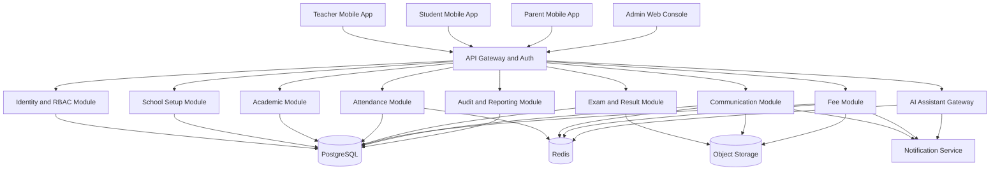
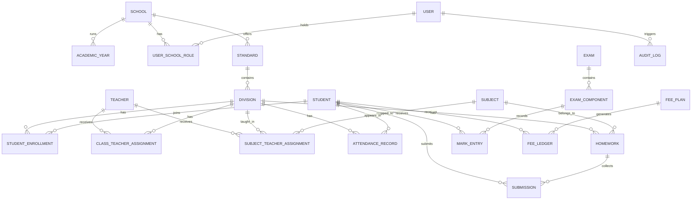
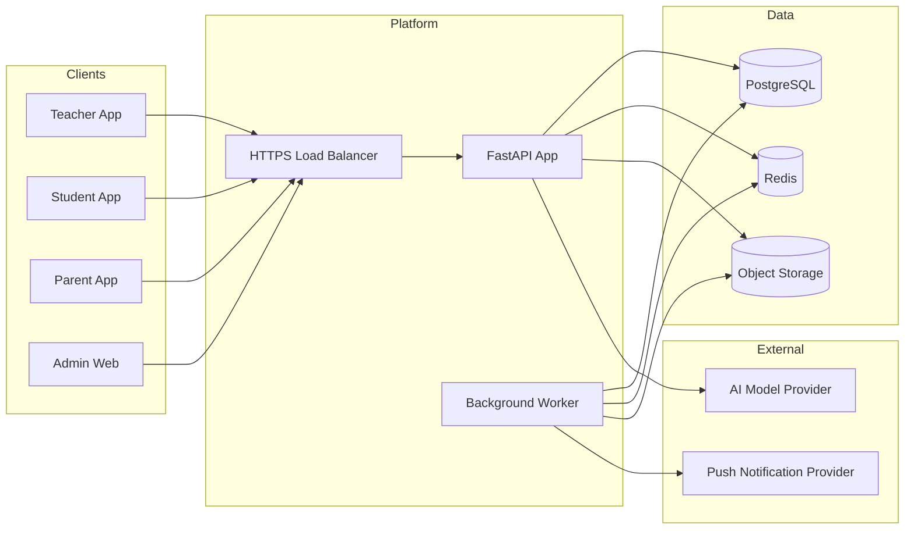

# School System Architecture

## Architecture Summary
The recommended implementation is a modular monolith first, with clean module boundaries so the product can later split selected workloads into services if scale requires it. This is the fastest and safest way to ship the first version without creating microservice overhead too early.

The architecture should support:
- Teacher mobile app
- Student mobile app
- Parent mobile app in phase 2
- Admin web console
- Shared design system and shared schema package
- Central API and authorization layer
- Audit-first school records

## Architecture Principles
- Mobile first for teacher and student workflows
- Role-safe by default
- Audit every sensitive change
- Offline-capable for attendance and homework
- Bilingual-ready from the start
- Simple operations model for schools with limited IT support

## Recommended Stack
| Layer | Recommendation | Why |
| --- | --- | --- |
| Teacher and student apps | React Native with Expo | Shared code, fast delivery, push notification support |
| Admin app | Next.js | Strong dashboard and reporting support |
| API layer | FastAPI | Good fit with current repo and clear modular backend design |
| Shared contracts | TypeScript or JSON schema package | One source of truth for payloads and UI types |
| Database | PostgreSQL | Strong relational model for school data |
| Cache and queue | Redis | Session cache, background jobs, retry queues |
| Object storage | S3-compatible bucket | Documents, circulars, report cards, student uploads |
| Notifications | FCM, APNs, WhatsApp gateway later | Mobile delivery and reminders |
| Analytics | Postgres views first, warehouse later | Low-cost reporting path |
| AI layer | OpenAI-backed assistant with policy gateway | Guardrailed assistance, multilingual summaries |

## System Context Diagram

## Module Design
### 1. Identity and RBAC
Owns:
- User accounts
- Role mapping
- School membership
- Permission policies
- Device sessions

Key rules:
- Every user belongs to one or more schools
- Every action is evaluated against school, academic year, and assigned scope
- Sensitive actions require audit logging

### 2. School Setup
Owns:
- School profile
- Academic year
- Board, medium, campus
- Standards and divisions
- Subject catalog
- Staff directory

### 3. Academic Module
Owns:
- Student profiles
- Student enrollment by year
- Teacher allocations
- Timetables
- Class and subject mapping

### 4. Attendance Module
Owns:
- Daily attendance
- Late marks
- Leave flags
- Follow-up status

Special behavior:
- Class teacher can mark full-division daily attendance
- Subject teacher can mark period or subject attendance only if enabled by school policy

### 5. Exam and Result Module
Owns:
- Exam terms
- Subject mark structures
- Mark entry windows
- Result approval
- Report card generation

### 6. Fee Module
Owns:
- Fee heads
- Installments
- Concessions
- Receipts
- Outstanding dues
- Student fee ledger

### 7. Communication Module
Owns:
- Broadcasts
- Circulars
- Class notices
- Subject notices
- Delivery status

### 8. AI Assistant Gateway
Owns:
- Prompt routing
- Permission-aware context selection
- Output moderation
- Action confirmation flow

AI is allowed to:
- Draft notices
- Summarize attendance or performance trends
- Translate messages between Marathi and English
- Answer timetable, homework, and result questions from existing data

AI is not allowed to:
- Finalize fee changes
- Publish marks without approval
- Edit attendance history directly
- Override permissions

## Recommended Domain Model

## Access Control Model
Use RBAC plus scoped resource checks.

| Role | Scope | Can view | Can edit |
| --- | --- | --- | --- |
| Admin | Entire school | All modules | All school data with policy checks |
| Principal | Entire school | All modules and analytics | Most records except restricted finance controls if separated |
| Class teacher | Assigned division | Students, attendance, notices, timetable, parent contact, results summary | Division attendance, class notices, remarks, follow-up |
| Subject teacher | Assigned subject and division | Assigned students, homework, subject marks, subject timetable | Homework, subject marks, subject notices |
| Exam coordinator | School or selected classes | Exams, marks, results | Exam setup, publish workflows |
| Accounts staff | Entire school or finance scope | Fee plans, ledgers, dues, receipts | Fee collections, concessions with approval rules |
| Student | Self only | Own academic and fee view | Limited profile preferences, submissions |
| Parent | Linked child only | Child notices, fee status, attendance, results | Leave requests, acknowledgement actions |

### Policy Examples
- Class teacher can update attendance where `division_id` is in assigned class-teacher scope
- Subject teacher can enter marks only where `subject_teacher_assignment_id` matches the record scope
- Student and parent can only read data linked to their own student profile
- Admin can see all school records, but fee waivers and result publication can require dual approval

## Critical Backend Workflows
- Sync-safe attendance writes
- Approval-required result publication
- Immutable fee receipt trail
- Notification fan-out with delivery tracking
- AI request context filtered by current user scope

## Deployment View

## Data and Security Requirements
- Every record must be tagged with `school_id` and `academic_year_id` where relevant
- Sensitive writes must capture `actor_id`, timestamp, before value, after value, and source device
- Fee receipts should be immutable after generation; reversals create compensating records
- Result publication should use draft, reviewed, approved, and published states
- Student personal data should be encrypted at rest where possible and always protected in transit
- Parent-child linking should support explicit verification

## Non-Functional Requirements
| Area | Target |
| --- | --- |
| Login | Under 3 seconds on normal mobile network |
| Dashboard load | Under 2 seconds from warm cache |
| Attendance sync | Recover from offline mode with conflict handling |
| Availability | 99.5 percent or better for school hours |
| Audit | 100 percent coverage for marks, fees, and notices |
| Accessibility | Large touch targets, readable contrast, screen-reader-friendly labels |

## Why This Architecture Fits the Product
- It respects the real school hierarchy instead of treating every teacher the same
- It keeps mobile use lightweight for classroom workflows
- It gives admin and finance teams a proper control tower
- It leaves room for AI without putting compliance-sensitive actions at risk
