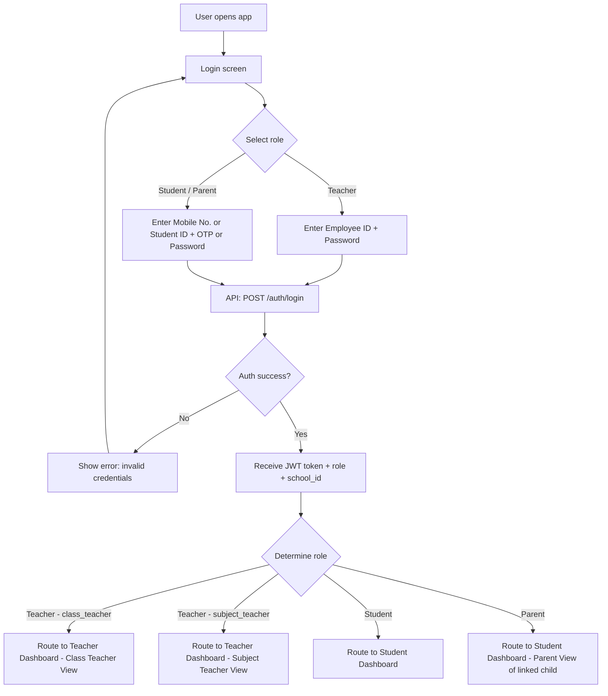
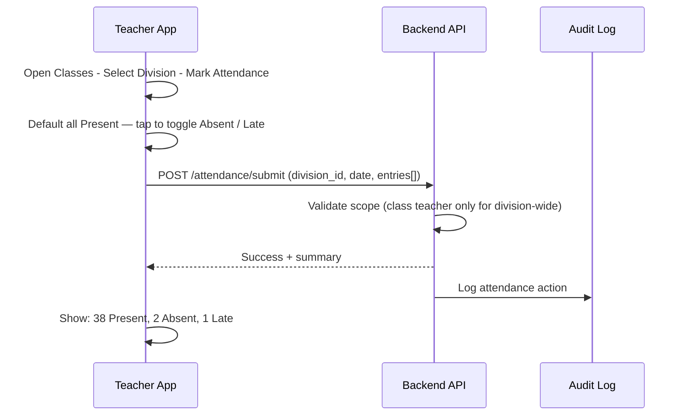

# Teacher & Student/Parent Web Mobile Application
## Complete Product Design Document

> **Scope**: This document defines the full design for the **Teacher & Student/Parent Web Mobile Application** — a progressive web app (PWA) / React Native web app that serves teachers, students, and parents from a single codebase with role-based experiences. This is the school-facing front-end that connects to the shared FastAPI backend also used by the Admin Desktop.

---

## 1. Application Overview

### What This App Is
A **single web/mobile application** accessible from any browser or installable as a PWA on Android and iOS. When a user lands on the app they see a unified login screen. After login, the system detects their role and routes them to their **dedicated layout and experience**.

### Who Uses It
| User | Experience | Device |
|---|---|---|
| **Teacher** (Class or Subject) | Teacher layout with class management tools | Smartphone, tablet |
| **Student** | Student layout with learning and progress tools | Smartphone, school tablet |
| **Parent / Guardian** | Linked to their child's student profile, same layout as student with parent-specific views | Smartphone |

### Application Type
- **Progressive Web App (PWA)** — installable, works offline for key features
- Built with **React + Vite** or **Next.js** (mobile-viewport-optimized)
- Shared design system with the Admin Desktop app
- Connects to the existing **FastAPI backend**

---

## 2. Shared Login Flow

### 2.1 Login Screen Design

```
+--------------------------------------------------+
|                                                  |
|            [School Logo]                         |
|         School Name Here                         |
|      Powered by EduSync                          |
|                                                  |
|  +--------------------------------------------+  |
|  |  I am a...                                 |  |
|  |  [ Teacher ]          [ Student / Parent ] |  |
|  +--------------------------------------------+  |
|                                                  |
|  [Mobile Number / Employee ID / Student ID]      |
|  [Password / OTP]                                |
|                                                  |
|  [ Login Button ]                                |
|                                                  |
|  Forgot Password?   |   Request Access           |
|                                                  |
|  [Language: English | Marathi]                   |
+--------------------------------------------------+
```

### 2.2 Login Flow Diagram


### 2.3 Login Rules
- Students can log in with Student ID (Admission Number) or registered mobile number
- Parents share the same login as or are linked to the student but see parent-specific controls
- Teachers log in with Employee ID
- OTP login available for parents and students via registered mobile number
- Session token is cached locally for 7-day silent re-login (PWA mode)
- Language chosen at login persists across the session

---

## 3. Teacher App — Full Design

### 3.1 Teacher App Navigation (Bottom Bar)

```
+--------------------------------------------------+
|                                                  |
|   [ CONTENT AREA — changes per tab ]            |
|                                                  |
+--------------------------------------------------+
| [Home]  [Classes]  [Exams]  [Messages]  [More]  |
+--------------------------------------------------+
```

| Tab | Icon | Purpose |
|---|---|---|
| **Home** | House | Dashboard — today's priorities |
| **Classes** | Book | Attendance, homework, timetable per class |
| **Exams** | Pen | Mark entry, exam schedules |
| **Messages** | Bell | Notices, broadcasts, AI drafts |
| **More** | Grid | Profile, leave, settings, AI assistant |

### 3.2 Teacher Dashboard (Home Tab)

#### Class Teacher View
```
+--------------------------------------------------+
| Good morning, Ms. Patil            [Apr 10]      |
| Std 8 Div A  |  Class Teacher                   |
+--------------------------------------------------+
| [!] ATTENDANCE PENDING                           |
|  41 students - Mark now -->                     |
+--------------------------------------------------+
| TODAY'S PERIODS                                  |
| 08:30  Maths         [ Mark Attendance ]         |
| 09:30  English       [ Add Homework ]            |
| 11:00  Science       [ View Timetable ]          |
+--------------------------------------------------+
| HOMEWORK TO REVIEW                               |
|  Maths  .  12 submissions  .  3 late            |
|  English  .  8 submissions  .  Open             |
+--------------------------------------------------+
| STUDENTS NEEDING ATTENTION                       |
|  Rohit A.  3 days absent  [ Contact Parent ]    |
|  Priya B.  Fee overdue    [ View Fee ]          |
+--------------------------------------------------+
| [AI ASSISTANT]                                   |
|  Draft a Marathi notice for tomorrow's test     |
|  [ Ask AI... ]                                  |
+--------------------------------------------------+
| [Home]  [Classes]  [Exams]  [Messages]  [More]  |
+--------------------------------------------------+
```

#### Subject Teacher View
```
+--------------------------------------------------+
| Good morning, Mr. Deshmukh         [Apr 10]      |
| Subject Teacher - Maths, Science               |
+--------------------------------------------------+
| TODAY'S PERIODS                                  |
| 08:30  Maths  .  Std 7 Div B  [ Start ]         |
| 10:00  Science  .  Std 8 Div A  [ View ]        |
+--------------------------------------------------+
| PENDING HOMEWORK REVIEW                          |
|  Maths HW  .  Std 7 Div B  .  14 submitted     |
+--------------------------------------------------+
| PENDING MARK ENTRY                               |
|  Unit Test 2  .  Maths  .  Std 7 Div B         |
|  [ Enter Marks — closes in 2 days ]             |
+--------------------------------------------------+
| RECENT SUBMISSIONS                               |
|  Sonal K.  .  Maths HW  .  Submitted 1 hr ago  |
+--------------------------------------------------+
| [Home]  [Classes]  [Exams]  [Messages]  [More]  |
+--------------------------------------------------+
```

### 3.3 Teacher — Classes Tab

#### Attendance Flow


#### Homework Composer Flow
1. Select subject and division
2. Enter title, description (with rich text)
3. Attach files (optional, max 10MB)
4. Set due date
5. Preview then Publish (notifies students automatically)

### 3.4 Teacher — Exams Tab
- View upcoming exam schedules
- Mark entry grid per student per subject
- Inline max-marks validation
- Submit for review (not directly published)
- View mark entry status across divisions

### 3.5 Teacher — Messages Tab
- Inbox: receive notices from admin/principal
- Compose: send notice to assigned class or subject group
- AI Draft shortcut: prompt AI to generate notice text
- Delivery status view (who read the notice)

### 3.6 Teacher — More Menu
- Profile (view/edit personal info)
- Apply Leave (triggers leave request to principal)
- Leave Balance (CL / SL / EL remaining)
- Language Switch
- Help and Support
- Logout

---

## 4. Student & Parent App — Full Design

### 4.1 Student/Parent App — Navigation Structure

The app uses a **bottom navigation bar with 5 tabs**. The **AI Learning tab (position 3, center)** is visually elevated and color-highlighted as the hero feature. The **Dashboard tab (position 1)** is the home base the student always returns to.

```
+--------------------------------------------------+
|                                                  |
|   [ MAIN CONTENT AREA — changes per tab ]       |
|                                                  |
+--------+--------+----------+--------+-----------+
| Dash-  | Tasks  | AI Learn | Sub.   | Notifi-   |
| board  | [icon] | [CENTER] | Perf.  | cations   |
| [icon] |        | elevated | [icon] | [icon]    |
+--------+--------+----------+--------+-----------+
  Tab 1    Tab 2    Tab 3      Tab 4    Tab 5
```

#### Bottom Navigation Tabs
| Position | Tab Name | Icon | Description |
|---|---|---|---|
| 1 | **Dashboard** | Home / grid icon | Home base — performance, attendance, timetable, fee snapshot |
| 2 | **Tasks** | Checklist | Today's and pending homework tasks |
| 3 | **AI Learning** | Sparkle (elevated, color-filled) | AI-powered personal learning assistant |
| 4 | **Subject Performance** | Bar chart | Per-subject academic tracking across all terms |
| 5 | **Notifications** | Bell | All school notices, alerts, and reminders |

> **Dashboard as Tab 1**: The Dashboard is now a **dedicated bottom tab** — always reachable from anywhere in the app. This is the student's home base showing their full academic snapshot. Tapping this from any other tab jumps them back to the overview.

---

### 4.2 Student Dashboard (Default Screen / Home)

The dashboard is a **scrollable card-based home screen** that gives the student and parent a complete snapshot of the student's academic life at a glance.

#### Dashboard Layout — Wireframe
```
+--------------------------------------------------+
| Good morning, Aarav!        [Apr 10, Thursday]  |
| Std 8 Div A  |  Roll No. 14                     |
| [Tap to switch to Parent View — Parent Name]     |
+--------------------------------------------------+
|                                                  |
|  PERFORMANCE SNAPSHOT  [This Term]   [Year]     |
|  +--------------------------------------------+  |
|  |   Overall Score     73%                    |  |
|  |   [Circular donut gauge — color coded]     |  |
|  |   Best: Science 88%  | Needs Attn: Hindi   |  |
|  +--------------------------------------------+  |
|                                                  |
|  ATTENDANCE SUMMARY  [This Month]  [This Term]  |
|  +--------------------+---------------------+   |
|  |  Present  22       |  Absent  3          |   |
|  |  Late     1        |  Leave   1          |   |
|  +------------------------------------------+   |
|  | Monthly calendar heatmap (dots per day)  |   |
|  | Green = Present  Red = Absent            |   |
|  | Amber = Late     Gray = Holiday          |   |
|  +------------------------------------------+   |
|  Attendance this month: 88%                      |
|  [Minimum required: 75% — You are safe]          |
|                                                  |
|  TODAY'S TIMETABLE                               |
|  08:30 Maths          (Ms. Patil)               |
|  09:30 English        (Mr. Joshi)               |
|  11:00 Science        (Mr. Deshmukh)            |
|  12:00 Lunch                                    |
|  01:00 History        (Ms. Shah)               |
|  02:00 PT / Free                               |
|                                                  |
|  FEE STATUS                                      |
|  [Paid] Term 1 — Rs. 4,500  [Receipt: RC-047]  |
|  [Due]  Term 2 — Rs. 4,500 — Due by 15 May     |
|                                                  |
+--------------------------------------------------+
| [Home] [Tasks] [AI Learn*] [Sub.Perf.] [Notif.] |
+--------------------------------------------------+
```

#### 4.2.1 Performance Visualization — Detailed Design

**Component Name**: `PerformanceSnapshotCard`

**Data shown**:
- Overall academic score (weighted average across all subjects for the selected term)
- A circular/donut gauge showing score with color bands:
  - 0-39%: Red (At Risk)
  - 40-59%: Amber (Needs Improvement)
  - 60-74%: Blue (Average)
  - 75-89%: Teal (Good)
  - 90-100%: Green (Excellent)
- Best performing subject (highest score)
- Weakest subject (lowest score, shown in amber/red)
- Toggle between: This Term | Previous Term | Full Year

**Chart Types Used**:
- Primary: Circular gauge (donut) for overall score — feels personal and engaging
- Secondary: Small sparkline bars for subject comparison (visible on scroll or expand)

**Component States**:
| State | What is shown |
|---|---|
| Data available | Gauge + best/weak subjects |
| No exams yet this term | "Your results will appear here once exams are completed" |
| Loading | Skeleton shimmer |
| Exam in progress | "Results pending — check back after result declaration" |

**Data Source**:
```
GET /students/{student_id}/performance-snapshot
Response:
{
  "term": "Term 1",
  "overall_percentage": 73.4,
  "grade": "B+",
  "best_subject": { "name": "Science", "score": 88, "max": 100 },
  "weakest_subject": { "name": "Hindi", "score": 54, "max": 100 },
  "subjects": [
    { "name": "Maths", "score": 76, "max": 100 },
    { "name": "Science", "score": 88, "max": 100 }
  ]
}
```

---

#### 4.2.2 Attendance Visualization — Detailed Design

**Component Name**: `AttendanceSummaryCard`

**Data shown**:
- Summary chips: Present / Absent / Late / On Leave counts
- **Monthly calendar heatmap** — a compact calendar grid where each day shows the attendance status as a colored dot:
  - Green dot = Present
  - Red dot = Absent
  - Amber dot = Late
  - Blue dot = On Leave / Duty Leave
  - Gray = Holiday / Weekend / School closed
- **Attendance percentage** for the selected period (this month / this term)
- Compliance indicator: "Minimum 75% required" — shows if the student is safe or at risk

**Toggle**: This Month | This Term | Full Year

**Alert States**:
| Condition | Message shown |
|---|---|
| Attendance >= 85% | Green badge: "Excellent attendance!" |
| 75% to 84% | Teal badge: "On track" |
| 60% to 74% | Amber badge: "Warning: attendance dropping" |
| Below 60% | Red badge: "Alert: Below minimum requirement" |

**Parent-specific addition**:
- Parent sees the same card but with an additional "Absence Details" link showing reason/notes for each absence logged by the teacher

**Data Source**:
```
GET /students/{student_id}/attendance-summary?period=month
Response:
{
  "period": "April 2026",
  "present": 22,
  "absent": 3,
  "late": 1,
  "on_leave": 1,
  "total_school_days": 27,
  "percentage": 88.9,
  "minimum_required": 75.0,
  "status": "safe",
  "calendar": [
    { "date": "2026-04-01", "status": "present" },
    { "date": "2026-04-02", "status": "absent" }
  ]
}
```

---

### 4.3 FOOTER COMPONENT 1 — Tasks Tab

**Tab Name**: Tasks
**Icon**: Checklist / tick-list icon
**Purpose**: Show the student all their homework and assignments — today's pending, old incomplete items, and submitted items.

#### Tasks Tab Layout
```
+--------------------------------------------------+
| TASKS                                            |
| [Today]   [This Week]   [All Pending]   [Done] |
+--------------------------------------------------+
|  TODAY — Apr 10, Thursday                        |
+--------------------------------------------------+
|  [ ] Maths Homework                              |
|      Posted by: Ms. Patil                        |
|      Due: Today by 11:59 PM                     |
|      [View Details]  [Mark as Done]             |
+--------------------------------------------------+
|  [ ] Science Diagram                             |
|      Posted by: Mr. Deshmukh                    |
|      Due: Today by 11:59 PM                     |
|      [View Details]                             |
+--------------------------------------------------+
|  PAST DUE — NOT COMPLETED          [RED SECTION] |
+--------------------------------------------------+
|  [!] English Essay                  OVERDUE      |
|      Due was: Apr 7 (3 days ago)               |
|      Posted by: Mr. Joshi                       |
|      [View Details]  [Submit Now]               |
+--------------------------------------------------+
|  [!] History Notes                  OVERDUE      |
|      Due was: Apr 5 (5 days ago)               |
|      [View Details]  [Submit Now]               |
+--------------------------------------------------+
|  SUBMITTED                                       |
+--------------------------------------------------+
|  [tick] Marathi Essay               Submitted   |
|      Submitted: Apr 9                           |
|      [View Feedback]                            |
+--------------------------------------------------+
```

#### Tasks — Design Rules (Critical)
- **Today's tasks** appear at the top in the default view
- **Past due / incomplete tasks** appear in a clearly marked **RED section** with a distinct red left border on each card
- Overdue task cards show:
  - Red "OVERDUE" badge
  - How many days overdue (e.g., "3 days ago")
  - A "Submit Now" action button
- **Completed / Submitted tasks** appear in the Submitted section with a green tick
- Students can mark tasks as done (local tracking — does not replace teacher verification)
- Filter tabs: Today | This Week | All Pending | Done

#### Tasks Data Model
```
GET /students/{student_id}/tasks
Response:
{
  "today": [
    {
      "task_id": "hw_001",
      "type": "homework",
      "title": "Maths Chapter 5 Exercise",
      "subject": "Maths",
      "posted_by": "Ms. Patil",
      "due_date": "2026-04-10T23:59:00",
      "status": "pending",
      "is_overdue": false,
      "days_overdue": 0,
      "attachment_count": 1
    }
  ],
  "overdue": [
    {
      "task_id": "hw_002",
      "title": "English Essay",
      "subject": "English",
      "due_date": "2026-04-07T23:59:00",
      "status": "pending",
      "is_overdue": true,
      "days_overdue": 3
    }
  ],
  "submitted": []
}
```

#### Tasks — Homework Detail Screen
```
+--------------------------------------------------+
| < Back               Maths Homework              |
+--------------------------------------------------+
| MATHS — Chapter 5 Exercise                       |
| Posted by: Ms. Patil  |  Std 8 Div A            |
| Posted on: Apr 8      |  Due: Apr 10, 11:59 PM  |
+--------------------------------------------------+
| INSTRUCTIONS                                     |
| Complete all exercises from Chapter 5 page 78.  |
| Show full working. Carry to school tomorrow.    |
+--------------------------------------------------+
| ATTACHMENTS                                      |
| [PDF: Chapter5_reference.pdf]                   |
+--------------------------------------------------+
| YOUR SUBMISSION                                  |
| [ Not yet submitted ]                           |
|                                                  |
| [Mark as Done]   [Ask AI for Help]              |
+--------------------------------------------------+
```

---

### 4.4 FOOTER COMPONENT 2 — AI Learning (Elevated Center Tab)

**Tab Name**: AI Learning
**Icon**: Sparkle / brain / wand icon (elevated, highlighted, color-filled — the hero feature)
**Purpose**: An AI-powered personal learning assistant that helps students understand concepts, prepare for exams, get explanations, and practice.

#### AI Learning Tab Layout
```
+--------------------------------------------------+
| AI LEARNING                    [Subject: All v] |
+--------------------------------------------------+
|  Hi Aarav! What would you like to learn today?  |
+--------------------------------------------------+
|  QUICK ACTIONS                                   |
|  +------------------+ +----------------------+   |
|  | Explain a Topic  | | Practice Questions   |   |
|  +------------------+ +----------------------+   |
|  +------------------+ +----------------------+   |
|  | Prepare for Test | | Summarize Chapter    |   |
|  +------------------+ +----------------------+   |
+--------------------------------------------------+
|  BASED ON YOUR WEAK AREAS                        |
|  You struggled with: Fractions in Maths         |
|  [Start Practice: Fractions]                    |
+--------------------------------------------------+
|  RECENT CHAT                                     |
|  Explain the water cycle  — Yesterday           |
|  Practice Maths fractions  — 2 days ago        |
+--------------------------------------------------+
|  [Type your question...          ] [Send]       |
+--------------------------------------------------+
```

#### AI Learning — Chat Interface
```
+--------------------------------------------------+
| < AI Learning             [Subject: Maths v]    |
+--------------------------------------------------+
|                                                  |
|   [AI]  Hello Aarav! What topic should we      |
|          explore today? I am ready to help!     |
|                                                  |
|   [Student]  Explain what is a fraction         |
|                                                  |
|   [AI]  Great question! A fraction represents  |
|          a part of a whole. Here is how:        |
|                                                  |
|          1/2 means 1 part out of 2 equal parts  |
|          [Visual: pie chart 1/2 highlighted]    |
|                                                  |
|          Try a practice question?               |
|          [Yes, try one!]  [Explain more]        |
|                                                  |
+--------------------------------------------------+
|  [Type your question...    ] [Send]  [Voice]    |
+--------------------------------------------------+
```

#### AI Learning — Feature List
| Feature | Description |
|---|---|
| Topic Explanation | Student asks any topic; AI explains at grade-appropriate level |
| Chapter Summary | Student selects subject + chapter; AI gives a bullet point summary |
| Practice Questions | AI generates MCQs, fill-in-the-blank, or short answer questions |
| Exam Preparation | AI creates a mock mini-test based on upcoming exam topics |
| Weak Area Focus | AI suggests practice based on student's low-scoring subjects |
| Voice Input | Student can speak their question (uses device mic) |
| Language Switch | Toggle between English and Marathi explanations |
| Concept Visual | AI inserts simple diagrams, icons, or step-by-step breakdowns |
| Save for Later | Student can bookmark an AI explanation to review later |

#### AI Learning — Guardrails (Critical Rules)
- AI is **scoped to the student's curriculum** (standard, board, syllabus)
- AI **cannot do homework for the student** — it explains and guides, does not write final answers
- AI responses are **logged** for improving recommendations (not for surveillance)
- AI may not share other students' data or advise on fees or admin matters
- If a question is outside curriculum scope, AI responds: "That's beyond my school scope — try asking your teacher!"
- Content filter blocks contentious topics, offensive content, and personal advice

#### AI Learning — API Surface
```
POST /ai/chat
Body: {
  "student_id": "...",
  "message": "Explain the water cycle",
  "subject": "Science",
  "session_id": "...",
  "language": "en"
}
Response: {
  "reply": "The water cycle is the continuous movement of water...",
  "suggestions": ["Try a practice question", "Summarize Chapter 3"],
  "safe": true
}

GET /ai/recommended-topics?student_id=...
Response: {
  "weakness_topics": [
    { "subject": "Maths", "topic": "Fractions", "score": 45 }
  ]
}
```

---

### 4.5 FOOTER COMPONENT 3 — Subject Performance Tab

**Tab Name**: Subject Performance
**Icon**: Bar chart / graph icon
**Purpose**: Give the student and parent a detailed, subject-by-subject view of academic performance across all exams and terms.

#### Subject Performance Tab Layout
```
+--------------------------------------------------+
| SUBJECT PERFORMANCE                              |
| [Term 1 v]   [All Subjects v]   [Compare v]     |
+--------------------------------------------------+
|  OVERALL  73%    Grade: B+    Rank: 12 / 41     |
|  [Progress bar — teal fill to 73%]              |
+--------------------------------------------------+
|  SUBJECTS                                        |
+--------------------------------------------------+
|  Maths                           76 / 100       |
|  [Progress bar 76%]   Grade B+                  |
|  Term1: 76  |  Previous: 68  [+8 improved]      |
|  [View Details]                                 |
+--------------------------------------------------+
|  Science                         88 / 100       |
|  [Progress bar 88%]   Grade A                   |
|  Term1: 88  |  Previous: 82  [+6 improved]      |
|  [View Details]                                 |
+--------------------------------------------------+
|  English                         71 / 100       |
|  [Progress bar 71%]   Grade B                   |
|  Term1: 71  |  Previous: 75  [-4 dropped]       |
|  [View Details]                                 |
+--------------------------------------------------+
|  Hindi                           54 / 100       |
|  [Progress bar 54%]   Grade C   [! alert]       |
|  Below class average (62)                       |
|  [Get AI Help for Hindi]  [View Details]        |
+--------------------------------------------------+
```

#### Subject Detail Screen
```
+--------------------------------------------------+
| < Subject Performance        MATHS               |
+--------------------------------------------------+
|  Teacher: Ms. Patil                             |
|  Your Score This Term: 76 / 100   Grade: B+     |
+--------------------------------------------------+
|  SCORE TREND                                     |
|  [Line chart: Term1 Prelim, Term1 Final,        |
|   Term2 Prelim, Term2 Final]                    |
|  Pre: 70   Final: 76   Improvement: +6          |
+--------------------------------------------------+
|  COMPONENT BREAKDOWN                             |
|  Written Test      52 / 70      (74%)           |
|  Oral / Practical  14 / 20      (70%)           |
|  Project / IA      10 / 10      (100%)          |
+--------------------------------------------------+
|  CLASS COMPARISON (Anonymous)                   |
|  Your score:  76                                |
|  Class avg:   72   |  Highest: 94  | Lowest: 41 |
|  [Position bar — no names shown]                |
+--------------------------------------------------+
|  AI INSIGHT                                     |
|  "You scored below average in Written Test.    |
|   Try practicing algebra problems to improve." |
|  [Start Maths Practice]                         |
+--------------------------------------------------+
```

#### Subject Performance — Feature List
| Feature | Description |
|---|---|
| All-Subject Overview | Scrollable list of all subjects with score bars |
| Grade Display | Letter grade per subject (configurable: A/B/C or 1-10 scale) |
| Trend Indicator | Improved / dropped arrows vs previous term |
| Rank | Class rank (optional — can be hidden per school setting) |
| Component Breakdown | Written vs practical vs project scores |
| Class Comparison | Anonymous benchmark — your score vs class average |
| AI Insight | One-line AI insight per subject with action link to AI Learning |
| Term Selector | Toggle between terms / academic year view |
| Parent View | Parent sees identical data for their linked child |

#### Data Model
```
GET /students/{student_id}/subject-performance?term=term1
Response:
{
  "term": "Term 1",
  "overall_percentage": 73.4,
  "grade": "B+",
  "rank": 12,
  "class_size": 41,
  "subjects": [
    {
      "subject_id": "maths_001",
      "subject_name": "Mathematics",
      "teacher_name": "Ms. Patil",
      "score": 76,
      "max_marks": 100,
      "grade": "B+",
      "percentage": 76.0,
      "previous_term_score": 68,
      "trend": "improved",
      "trend_delta": 8,
      "class_average": 72,
      "class_highest": 94,
      "components": [
        { "name": "Written Test", "score": 52, "max": 70 },
        { "name": "Oral / Practical", "score": 14, "max": 20 },
        { "name": "Project / IA", "score": 10, "max": 10 }
      ],
      "ai_insight": "Practice algebra to improve written test scores"
    }
  ]
}
```

---

### 4.6 FOOTER COMPONENT 4 — Notifications Tab

**Tab Name**: Notifications
**Icon**: Bell icon (with badge count for unread)
**Purpose**: Central inbox for all school communications directed at the student or parent.

#### Notifications Tab Layout
```
+--------------------------------------------------+
| NOTIFICATIONS              [Mark all read]       |
| [All]  [Academic]  [Fee]  [Admin]  [AI Tips]    |
+--------------------------------------------------+
|  NEW                                             |
+--------------------------------------------------+
|  [Megaphone] SCHOOL NOTICE                  NEW |
|  Unit Test schedule for April announced.        |
|  From: Principal  |  School-wide               |
|  Today, 9:00 AM                  [Read More]   |
+--------------------------------------------------+
|  [Book] HOMEWORK ASSIGNED                   NEW |
|  Maths Ch.5 Exercise due today.                |
|  From: Ms. Patil  |  Std 8 Div A              |
|  Today, 8:00 AM                  [Go to Task]  |
+--------------------------------------------------+
|  [Rupee] FEE REMINDER                      NEW |
|  Term 2 fee of Rs. 4,500 due by May 15.        |
|  From: Accounts                                |
|  Yesterday, 4:00 PM              [View Fee]    |
+--------------------------------------------------+
|  EARLIER THIS WEEK                              |
+--------------------------------------------------+
|  [Chart] RESULT PUBLISHED                       |
|  Term 1 results are now available.             |
|  Apr 7, 2:00 PM              [View Results]    |
+--------------------------------------------------+
|  [Star] AI LEARNING TIP                         |
|  You have not practiced Hindi in 5 days!       |
|  Apr 6, 6:00 PM            [Start Practice]   |
+--------------------------------------------------+
```

#### Notification Types
| Type | Icon | Color | Source | Action |
|---|---|---|---|---|
| School Notice / Circular | Megaphone | Blue | Admin / Principal | Read full notice |
| Homework Assigned | Book | Teal | Teacher | Go to Tasks tab |
| Result Published | Trophy | Green | Exam module | Go to Subject Performance |
| Attendance Alert | Calendar | Amber | System (auto) | View attendance |
| Fee Reminder | Rupee | Orange | Accounts | View fee status |
| Fee Receipt | Receipt | Green | Accounts | View/download receipt |
| Leave Approved | Check | Green | Admin | View leave calendar |
| AI Learning Tip | Sparkle | Purple | AI system | Start AI session |
| System Alert | Warning | Red | System | View detail |

#### Notification Rules
- Unread badge on bell icon shows count (max shown: 99+)
- Notifications are grouped by date: Today, Yesterday, This Week, Earlier
- Each notification deep-links to the relevant screen
- Parent gets additional proactive alerts:
  - "Your child was marked absent today"
  - "Fee due in 3 days" (earlier warning than student sees)
- Notifications can be dismissed but not deleted (they move to Earlier section)
- Push notifications sent via PWA push or FCM for native wrapper

#### Notification Data Model
```
GET /notifications?user_id=...&page=1
Response:
{
  "unread_count": 4,
  "notifications": [
    {
      "notification_id": "notif_001",
      "type": "homework_assigned",
      "title": "Maths Homework Assigned",
      "body": "Maths Ch.5 Exercise due today by 11:59 PM",
      "from": "Ms. Patil",
      "scope": "std8_divA",
      "created_at": "2026-04-10T08:00:00",
      "read": false,
      "action_url": "/tasks/hw_001",
      "action_label": "Go to Task"
    }
  ]
}

POST /notifications/{notification_id}/mark-read
POST /notifications/mark-all-read
```

---

### 4.7 FOOTER COMPONENT 5 — Dashboard Tab (Home Base)

**Tab Name**: Dashboard
**Icon**: Home / grid icon
**Position**: Tab 1 (leftmost — the natural home position)
**Purpose**: The student's permanent home base. A single-screen snapshot of everything that matters — overall performance, attendance health, today's schedule, task alerts, and fee status. Tapping this from any other tab always brings the student back to their full overview.

#### Dashboard Tab Layout
```
+--------------------------------------------------+
| Good morning, Aarav!        [Apr 10, Thursday]  |
| Std 8 Div A  |  Roll No. 14                     |
| [Parent View: Mrs. Sharma v]                     |
+--------------------------------------------------+
|  PERFORMANCE SNAPSHOT                [This Term] |
|  +--------------------------------------------+  |
|  |   [Donut gauge — 73% — teal arc ]          |  |
|  |      73%   Grade: B+                       |  |
|  |  Best: Science 88%  Weak: Hindi 54%        |  |
|  +--------------------------------------------+  |
|  [See all subjects -->]                          |
+--------------------------------------------------+
|  ATTENDANCE              [Apr]  88%  [On Track]  |
|  [ Calendar heatmap — dots per day ]             |
|  Present 22  Absent 3  Late 1  Leave 1           |
|  [See full attendance -->]                       |
+--------------------------------------------------+
|  TODAY'S TIMETABLE          [Apr 10, Thursday]  |
|  08:30 Maths    09:30 English   11:00 Science   |
|  12:00 Lunch    01:00 History   02:00 PT        |
+--------------------------------------------------+
|  TASKS AT A GLANCE                               |
|  [!] 2 tasks due today  [!] 2 overdue tasks      |
|  [Go to Tasks -->]                               |
+--------------------------------------------------+
|  FEE STATUS                                      |
|  Term 1 [Paid]  Term 2 [Due by May 15]          |
|  [View Fee Details -->]                          |
+--------------------------------------------------+
|[Home] [Tasks] [AI Learn*] [Sub.Perf.] [Notif.]  |
+--------------------------------------------------+
```

#### Dashboard Tab — Feature List
| Card | Content | Deep-link |
|---|---|---|
| **Greeting & Context** | Student name, standard, division, roll no. | Parent switcher at top |
| **Performance Snapshot** | Donut gauge with overall %, grade, best + weak subject | Tap navigates to Subject Performance tab |
| **Attendance Summary** | Calendar heatmap + count chips + % + status | Tap navigates to Attendance Detail screen |
| **Today's Timetable** | Compact period list for the current day | Static — no drill-down needed |
| **Tasks at a Glance** | Count of today's tasks and overdue tasks | Tap navigates to Tasks tab |
| **Fee Status** | Term-wise paid/due status | Tap navigates to Fee Status screen |

#### Dashboard Tab — Interaction Rules
- All cards are **tappable** and deep-link to the relevant tab or sub-screen
- Performance gauge shows **This Term** by default with a small toggle for Year view
- Attendance heatmap shows **current month** by default — tapping expands to full attendance screen
- Tasks at a Glance shows **count badges only** — actual task list is in the Tasks tab
- Overdue tasks badge shows in **red** on the Tasks count line
- Fee card shows **pulsing amber border** when there is a due amount approaching
- Dashboard auto-refreshes when the student returns to this tab from any other tab

#### Dashboard Tab — Component States
| Section | Empty / Loading State |
|---|---|
| Performance Snapshot | "Results will appear after exams are declared" |
| Attendance | "Attendance data syncing..." then cached data |
| Today's Timetable | "No timetable set yet — check back soon" |
| Tasks at a Glance | "All caught up — no pending tasks!" |
| Fee Status | "Fee plan not yet assigned for this year" |

#### Dashboard Tab — Parent View Differences
```
+--------------------------------------------------+
| Viewing: Aarav's Dashboard   [Switch Child v]    |
| Std 8 Div A  |  Roll No. 14                     |
+--------------------------------------------------+
|  [Performance + Attendance cards — same as above] |
+--------------------------------------------------+
|  TASKS AT A GLANCE                               |
|  [!] 2 tasks due today  [!] 2 overdue tasks      |
+--------------------------------------------------+
|  FEE STATUS                [Download Receipt]    |
|  Term 1 [Paid — Rs 4500]                        |
|  Term 2 [Due — Rs 4500 — by May 15]  [Pay Now]  |
+--------------------------------------------------+
|  ATTENDANCE ALERT (parent-only)                  |
|  Aarav was absent on Apr 8.                     |
|  Reason logged: Sick leave                      |
|  [Contact School]                               |
+--------------------------------------------------+
```

#### Dashboard Tab — API Surface
```
GET /students/{student_id}/dashboard-summary
Response:
{
  "student": {
    "name": "Aarav Sharma",
    "standard": "8",
    "division": "A",
    "roll_number": 14
  },
  "performance": {
    "overall_percentage": 73.4,
    "grade": "B+",
    "best_subject": "Science",
    "weakest_subject": "Hindi"
  },
  "attendance": {
    "present": 22,
    "absent": 3,
    "late": 1,
    "on_leave": 1,
    "percentage": 88.9,
    "status": "safe",
    "calendar": [ ... ]
  },
  "timetable_today": [
    { "time": "08:30", "subject": "Maths", "teacher": "Ms. Patil" }
  ],
  "tasks_summary": {
    "due_today": 2,
    "overdue": 2
  },
  "fee_summary": {
    "current_term": "Term 2",
    "status": "due",
    "amount": 4500,
    "due_date": "2026-05-15"
  }
}
```

---

## 5. Parent-Specific Experience

### 5.1 Parent View Differences

Parents log in via the same app but see a child-centric view. If a parent has multiple children in the same school, they see a child switcher at the top.

```
+--------------------------------------------------+
| Viewing: Aarav (Std 8 A)  [Switch Child v]      |
+--------------------------------------------------+
```

### 5.2 Parent-Only Features
| Feature | Location | Description |
|---|---|---|
| Child Switcher | Top bar | Switch between linked children |
| Absence Detail | Attendance card | See teacher's noted reason for each absence |
| Leave Application | Notifications / More | Apply for planned absence on behalf of child |
| Fee Payment View | Fee status card | View fee status, download receipts |
| Parent-Teacher Message | Notifications | Receive from class teacher, reply if enabled |
| Result Download | Subject Performance | Download report card PDF |

### 5.3 Parent Dashboard Differences
- Dashboard header shows "Viewing Aarav's Progress" instead of greeting the student
- Attendance card shows a "Contact School" button if absence count is high
- Performance card shows a "Download Report Card" button after result publication
- Fee card is more prominent on parent view

---

## 6. Screen Inventory

### Shared / Auth Screens
| Screen | ID | Description |
|---|---|---|
| Login | SCR-001 | Role selector + credentials entry |
| OTP Verify | SCR-002 | OTP entry for mobile login |
| Forgot Password | SCR-003 | Reset via registered mobile |
| Language Select | SCR-004 | Initial language choice |

### Teacher Screens
| Screen | ID | Description |
|---|---|---|
| Teacher Dashboard | SCR-T01 | Role-aware home (class teacher or subject teacher) |
| Class List | SCR-T02 | All assigned classes / divisions |
| Attendance Marking | SCR-T03 | Division attendance grid |
| Homework Composer | SCR-T04 | Create and publish homework |
| Homework Review | SCR-T05 | View student submissions |
| Timetable View | SCR-T06 | Teacher's weekly timetable |
| Marks Entry | SCR-T07 | Enter marks per subject per student |
| Notice Compose | SCR-T08 | Write and publish notice |
| AI Draft Panel | SCR-T09 | AI-assisted notice / summary drafting |
| Leave Apply | SCR-T10 | Apply for leave |
| Leave Balance | SCR-T11 | View CL/SL/EL balance |
| Teacher Profile | SCR-T12 | Personal info, settings |
| Notifications | SCR-T13 | Inbox for teacher |

### Student / Parent Screens
| Screen | ID | Description |
|---|---|---|
| Student Dashboard (Tab) | SCR-S00 | Full dashboard home — performance, attendance, timetable, tasks at a glance, fee status |
| Tasks — Today | SCR-S02 | Today's pending tasks |
| Tasks — Overdue | SCR-S03 | Past-due tasks in red section |
| Tasks — Submitted | SCR-S04 | Completed task history |
| Homework Detail | SCR-S05 | Full task details + submission |
| AI Learning Home | SCR-S06 | Quick actions + topic suggestions |
| AI Learning Chat | SCR-S07 | Conversational AI interface |
| AI Practice Mode | SCR-S08 | AI-generated practice questions |
| Subject Performance Overview | SCR-S09 | All-subject score list |
| Subject Detail | SCR-S10 | Single subject deep-dive |
| Notifications | SCR-S11 | Full notification inbox |
| Notice Detail | SCR-S12 | Full text of a school notice |
| Fee Status | SCR-S13 | Fee plan, paid, due, receipts |
| Attendance Detail | SCR-S14 | Calendar heatmap + absence log |
| Student Profile | SCR-S15 | Student personal info |
| Parent — Child Switcher | SCR-P01 | Switch between children |
| Parent — Leave Apply | SCR-P02 | Apply leave for child |
| Parent — Report Card | SCR-P03 | Download report card PDF |

---

## 7. Component Inventory

### Shared Components
| Component | Description |
|---|---|
| AppShell | Top bar, bottom nav, content scroll area |
| RoleBadge | Shows current role (Class Teacher, Student, etc.) |
| LanguageToggle | Switch between English and Marathi |
| StatusChip | Color-coded status label (Present, Absent, Due, etc.) |
| AlertCard | Attention card (color coded, icon, action button) |
| EmptyState | Empty result placeholder with guidance text |
| LoadingSkeleton | Shimmer loading placeholder |
| OfflineBanner | Shows when app is in offline mode with last-sync time |
| DeepLinkButton | Button that navigates to another module/screen |

### Dashboard Components
| Component | Description |
|---|---|
| PerformanceSnapshotCard | Donut gauge + best and weakest subject highlights |
| AttendanceSummaryCard | Chip counts + monthly calendar heatmap |
| TodayTimetableCard | Horizontal scrollable period list |
| FeeStatusCard | Term-wise fee paid/due status with receipt link |

### Tasks Components
| Component | Description |
|---|---|
| TaskCard | Individual task tile (pending / overdue / submitted variants) |
| OverdueTaskCard | Red-bordered task card variant for past-due items |
| TaskFilterBar | Tab strip: Today / This Week / All Pending / Done |
| HomeworkDetailView | Full homework detail with attachment and action |

### AI Learning Components
| Component | Description |
|---|---|
| AIQuickActionGrid | 2x2 tile grid of AI entry points |
| WeakAreaSuggestion | Subject-specific practice suggestion card |
| AIChatBubble | Student and AI message bubble pair |
| AIPracticeCard | Single practice question card (MCQ / short answer) |
| AIInsightChip | Inline insight shown in Subject Performance tab |

### Subject Performance Components
| Component | Description |
|---|---|
| SubjectScoreBar | Horizontal progress bar with score and grade |
| TrendIndicator | Up/down arrow with delta value |
| ScoreTrendChart | Line chart for score across terms |
| ComponentBreakdownList | Written / Oral / Project score breakdown |
| ClassComparisonBar | Anonymous position bar within class range |

### Notification Components
| Component | Description |
|---|---|
| NotificationCard | Individual notification tile |
| NotificationBadge | Red unread count badge on bell icon |
| NotificationFilterBar | Tab strip: All / Academic / Fee / Admin / AI Tips |
| NoticeDetailView | Full notice text view |

---

## 8. Design Tokens — App-Level

```css
/* Color Tokens */
--color-primary-700: #1f4e79;
--color-primary-500: #2d6ea3;
--color-accent-500: #0f8b8d;
--color-success-500: #2e8b57;
--color-warning-500: #d8891c;
--color-danger-500: #c44536;
--color-bg: #f7f4ee;
--color-surface: #fffdf9;
--color-text: #1d2733;
--color-muted: #65758b;

/* AI Feature Color */
--color-ai-purple: #7c3aed;
--color-ai-light: #ede9fe;

/* Score Band Colors */
--color-score-excellent: #2e8b57;    /* 90-100% */
--color-score-good: #0f8b8d;          /* 75-89% */
--color-score-average: #2d6ea3;       /* 60-74% */
--color-score-warning: #d8891c;       /* 40-59% */
--color-score-danger: #c44536;        /* 0-39% */

/* Attendance Colors */
--color-att-present: #2e8b57;
--color-att-absent: #c44536;
--color-att-late: #d8891c;
--color-att-leave: #2d6ea3;
--color-att-holiday: #d1d5db;

/* Typography */
--font-heading: 'Plus Jakarta Sans', sans-serif;
--font-body: 'Source Sans 3', sans-serif;
--font-devanagari: 'Noto Sans Devanagari', sans-serif;

/* Spacing (8-point grid) */
--space-1: 4px;   --space-2: 8px;
--space-3: 16px;  --space-4: 24px;
--space-5: 32px;  --space-6: 48px;

/* Border Radius */
--radius-card: 12px;
--radius-chip: 20px;
--radius-button: 8px;

/* Shadows */
--shadow-card: 0 2px 8px rgba(31, 78, 121, 0.08);
--shadow-elevated: 0 4px 16px rgba(31, 78, 121, 0.12);
```

---

## 9. API Surface Summary

### Authentication
- `POST /auth/login`
- `POST /auth/otp/request`
- `POST /auth/otp/verify`
- `POST /auth/logout`
- `GET /auth/me`

### Student Dashboard
- `GET /students/{id}/performance-snapshot`
- `GET /students/{id}/attendance-summary`
- `GET /students/{id}/today-timetable`
- `GET /students/{id}/fee-status`

### Tasks (Homework)
- `GET /students/{id}/tasks`
- `GET /homework/{id}`
- `POST /homework/{id}/mark-done`
- `POST /homework/{id}/submit`

### AI Learning
- `POST /ai/chat`
- `GET /ai/recommended-topics`
- `POST /ai/start-practice`
- `GET /ai/sessions`

### Subject Performance
- `GET /students/{id}/subject-performance`
- `GET /students/{id}/subject/{subject_id}/performance-detail`

### Notifications
- `GET /notifications`
- `POST /notifications/{id}/mark-read`
- `POST /notifications/mark-all-read`
- `DELETE /notifications/{id}`

### Teacher APIs
- `GET /teacher/dashboard`
- `POST /attendance/submit`
- `POST /homework/create`
- `GET /homework/{id}/submissions`
- `POST /marks/submit`
- `POST /notices/publish`
- `POST /leave/apply`

---

## 10. UX States — All Critical Paths

### Standard States
| State | How to Handle |
|---|---|
| Loading | Skeleton shimmer on cards, spinner on data tables |
| Empty | Friendly illustration + guidance text |
| Error | Error card with retry button + message in plain language |
| Offline | Offline banner at top; cached data visible; write actions queued |
| Partial load | Show available data; shimmer for loading parts; no full-page block |

### Specific Empty States
| Screen | Empty State Message |
|---|---|
| Tasks | "No pending tasks! You are all caught up." |
| AI Learning | "Start by asking any question!" |
| Subject Performance | "Results will appear after exams are declared" |
| Notifications | "You are all caught up — no new notifications" |

---

## 11. Offline Capability Plan

| Feature | Offline Available? | Behaviour |
|---|---|---|
| Dashboard (cached) | Yes | Shows last-synced data with timestamp |
| Tasks list | Yes | Cached; new tasks show when online |
| Mark task done | Queued | Action queued, syncs on reconnect |
| AI Learning | No | Shows "AI needs internet" message |
| Subject Performance | Yes | Cached scores shown |
| Notifications | Yes | Cached list shown; new ones trigger on reconnect |
| Teacher Attendance | Yes | Drafts stored locally, sync on reconnect |
| Teacher Homework Post | Queued | Queued, synced when online |

---

## 12. Phased Delivery

### Phase 1 — Core App Foundation (Weeks 1–6)
- [ ] Login screen with role routing (Teacher / Student / Parent)
- [ ] Student Dashboard — performance snapshot + attendance visualization
- [ ] Tasks tab — today's tasks + overdue in red
- [ ] Notifications tab — basic inbox
- [ ] Teacher dashboard (class teacher and subject teacher views)
- [ ] Teacher attendance flow

### Phase 2 — Learning & Performance (Weeks 7–10)
- [ ] Subject Performance tab — full detail screens
- [ ] AI Learning tab — basic chat interface with topic suggestions
- [ ] Homework detail screen with attachment support
- [ ] Teacher homework composer and review
- [ ] Mark entry screen for teachers

### Phase 3 — AI Enhancement & Parent Features (Weeks 11–14)
- [ ] AI practice mode (MCQ and short answer generation)
- [ ] AI weak-area recommendations from exam performance
- [ ] Parent login and child switcher
- [ ] Parent-specific features (leave apply, report card download)
- [ ] Push notification delivery (PWA + FCM)
- [ ] Language toggle (Marathi/English full app)

### Phase 4 — Polish & Integration (Weeks 15–16)
- [ ] Offline mode with sync queue
- [ ] Deep notifications (each type links to correct screen)
- [ ] Performance optimizations (lazy loading, caching)
- [ ] Accessibility pass (screen reader, large text)
- [ ] User testing and iteration

---

## 13. Integration with Admin Desktop App

| Event in Admin Desktop | Impact on Teacher/Student App |
|---|---|
| Student enrolled via Admissions module | Student account created; can now log in |
| Fee collected in Admin | Student fee status card updates; parent gets receipt notification |
| Exam result published | Subject Performance tab shows new scores; notification sent |
| Leave approved in Admin | Teacher's leave balance updates; teacher gets notification |
| Circular issued in Admin | Appears in Notifications tab for all students/teachers |
| Timetable configured in Admin | Teacher and student timetable views update |

---

*Document Version: 1.0 | Created: April 2026 | Author: System Architecture Design*
*Part of the School System Design Package. See also: README.md, architecture.md, admin-desktop-design.md, workflows.md, ui-ux.md*
