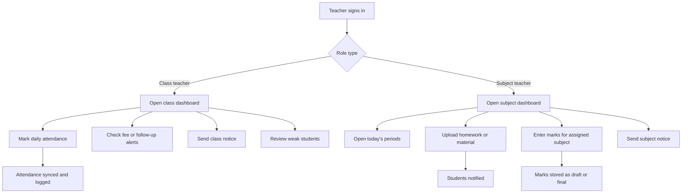
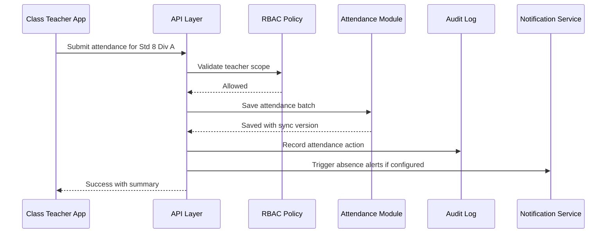
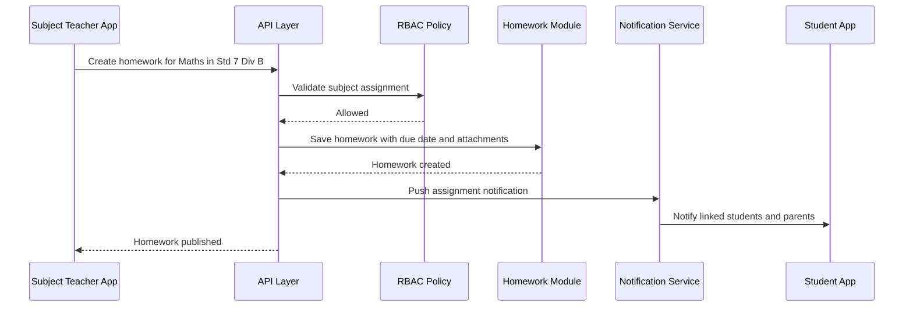
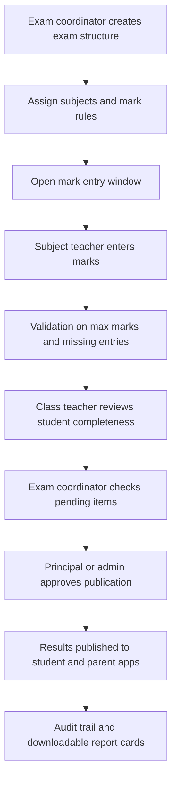
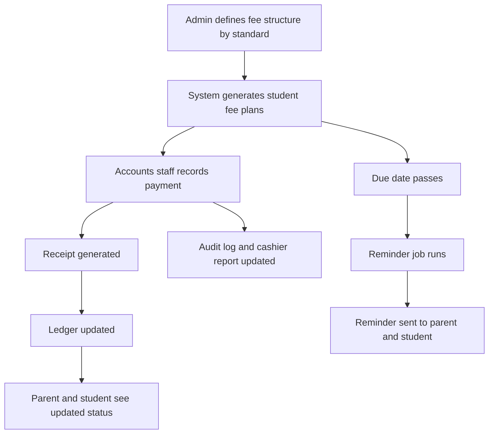
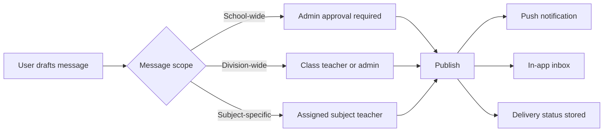
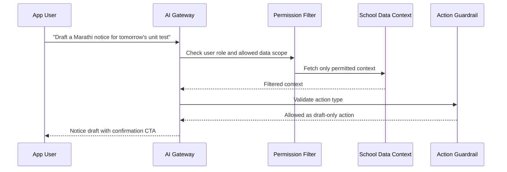
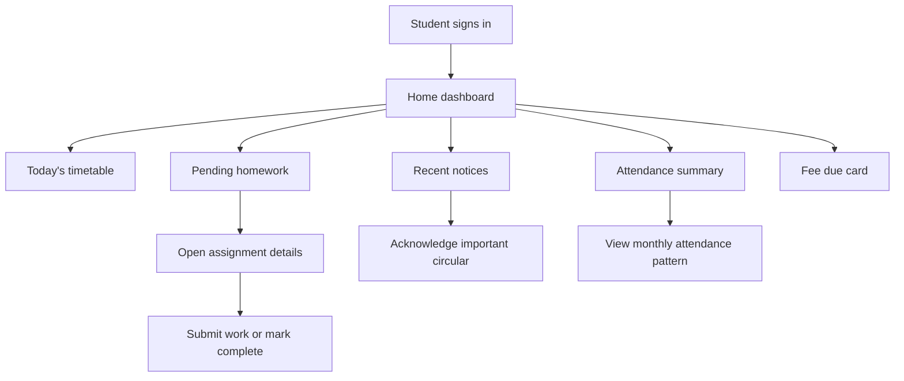

# School System Workflows

## Workflow Goals
These workflows are designed around real day-to-day school operations:
- Fast teacher actions during busy school hours
- Clear approvals for sensitive records
- Low confusion between class teacher and subject teacher responsibilities
- Full auditability for admin monitoring

## 1. Teacher Daily Workflow

## 2. Attendance Workflow

### Attendance Business Rules
- Class teacher can submit division-wide daily attendance
- Subject teacher can only submit period attendance if school enables the feature
- Late edits after cutoff should require reason capture
- Admin sees attendance exceptions and missing submissions

## 3. Homework and Assignment Workflow

## 4. Exam and Result Workflow

### Exam Control Rules
- Subject teachers only edit marks for their allocated subject and class
- Result publication should never happen directly from teacher screens
- Any post-publication correction should create a correction log

## 5. Fee Workflow

### Fee Rules
- Fee edits and concessions should support approval workflow
- Receipts should not be silently overwritten
- Student app shows status only; edit rights stay with finance roles

## 6. Broadcast Workflow

## 7. AI Assistant Workflow

### AI Guardrails
- AI can suggest, summarize, translate, and draft
- AI cannot directly finalize marks, fee changes, or attendance corrections
- Any AI-produced action must show the originating data scope and ask for human confirmation

## 8. Student Daily Workflow

## Workflow Design Takeaways
- Class teacher workflows are division-centric
- Subject teacher workflows are subject-centric
- Admin workflows are monitoring-centric
- Student workflows are clarity-centric
- Sensitive operations use staged approvals and audit logs
